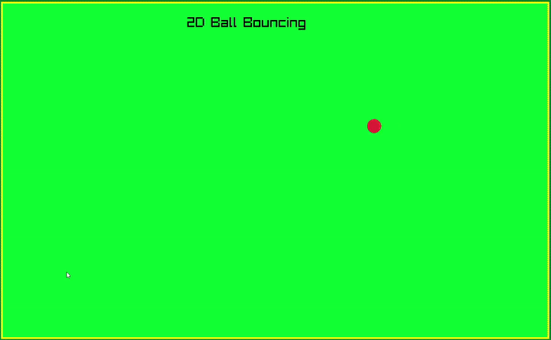

# Bouncing Ball

A simple physics simulation using [raylib](https://www.raylib.com/) where you can drag and shoot a ball that bounces off the walls, with gravity and sound effects.

## Features

- **Intuitive Drag and Shoot:** Click and drag with your mouse to set the angle and power, then release to launch the ball.
- **Realistic Physics:** The ball bounces off the walls with velocity dampening and is continuously pulled downward by gravity.
- **Sound Effects:** A satisfying damp sound plays every time the ball collides with a wall for an immersive experience.

## Requirements

- [raylib](https://www.raylib.com/) (v4.0 or higher recommended)
- C++ compiler (e.g., g++, clang++, MinGW)
- [CMake](https://cmake.org/) or Make (optional, for building)

## Installation

### 1. Clone the repository
```bash
git clone https://github.com/Am1n1602/bouncing-ball.git
cd bouncing-ball
```

### 2. Install raylib

#### On **Linux** (Ubuntu/Debian):
```bash
sudo apt-get install libraylib-dev
```
Or build from source:
```bash
git clone https://github.com/raysan5/raylib.git
cd raylib
mkdir build && cd build
cmake ..
make
sudo make install
```
See the [raylib wiki for Linux](https://github.com/raysan5/raylib/wiki/Working-on-GNU-Linux) for further details.

#### On **Windows**:
- Download and run the [raylib installer for Windows](https://github.com/raysan5/raylib/releases).
- Or, set up raylib with MSYS2:
  ```bash
  pacman -S mingw-w64-x86_64-raylib
  ```
- For Visual Studio or more, see the [raylib Windows guide](https://github.com/raysan5/raylib/wiki/Working-on-Windows).

### 3. Build the project

#### Using Makefile
```bash
make
```

#### Using CMake (Recommended)
```bash
mkdir build && cd build
cmake ..
make
```

#### Compile manually (if needed/Not Tested)
```bash
g++ source.cpp -o bouncing-ball -lraylib -lGL -lm -lpthread -ldl -lrt -lX11
```
*(Adjust linker flags as needed for your OS.)*

### 4. Run the simulation
```bash
./bouncing-ball
```

## How to Play

- **Drag:** Click and drag the ball with your mouse to choose direction and force.
- **Shoot:** Release the mouse button to launch.
- **Bounce:** The ball will bounce off the walls and be pulled down by gravity.
- **Listen:** Each wall collision triggers a damp sound effect.

## Demo


## Issues
Sound effect is not working on Linux devices. 

## License

MIT License

---
